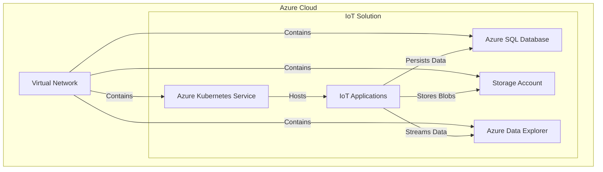

# IoT Solution

This solution demonstrates a typical IoT architecture on Azure using Terraform modules from this repository.

## Resources Deployed

- **Azure Kubernetes Service (AKS)**: For hosting containerized IoT applications.
- **Azure SQL Server**: For structured data storage.
- **Storage Account**: For blob storage.
- **Virtual Network**: For network isolation.
- **Azure Data Explorer**: For IoT data analytics.

## Architecture



## Usage

1. Navigate to the directory:
   ```bash
   cd solutions/iot
   ```
2. Initialize Terraform:
   ```bash
   terraform init
   ```
3. Review `variables.tf` and provide necessary values.
4. Apply the configuration:
   ```bash
   terraform apply
   ```
